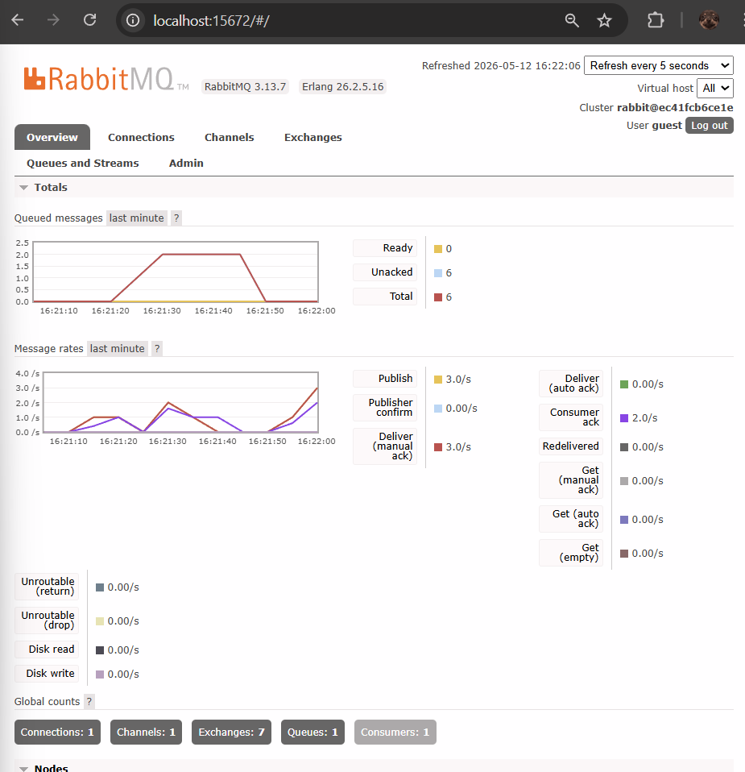
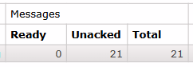

a. Apa itu AMQP?

AMQP atau Advanced Message Queuing Protocol adalah protokol standar terbuka untuk message-oriented middleware yang memungkinkan berbagai aplikasi dan sistem untuk saling berkomunikasi secara efisien. Dalam arsitektur event-driven, AMQP berfungsi sebagai bahasa komunikasi antara publisher sebagai pengirim pesan, message broker seperti RabbitMQ, dan subscriber sebagai penerima pesan. Protokol ini memastikan bahwa pesan dikirim, dirutekan, dan disimpan dengan aman dalam antrean sampai penerima siap memprosesnya, sehingga sistem tetap stabil meskipun ada lonjakan beban.

b. Apa arti dari guest:guest@localhost:5672?

String guest:guest@localhost:5672 merupakan Connection URI yang digunakan oleh program untuk melakukan autentikasi dan membangun koneksi dengan layanan message broker. Komponen pertama berupa kata guest sebelum tanda titik dua berfungsi sebagai username default yang telah diatur oleh sistem RabbitMQ . Komponen kedua yaitu kata guest setelah tanda titik dua merupakan password default untuk kredensial akses tersebut. Selanjutnya, bagian localhost mengacu pada alamat host yang menunjukkan bahwa layanan message broker berjalan secara lokal pada komputer yang sama dengan aplikasi. Terakhir, angka 5672 merujuk pada nomor port standar yang digunakan oleh protokol AMQP agar publisher maupun subscriber dapat mengirim dan menerima pesan melalui RabbitMQ.

### Simulation slow subscriber

Alasan mengapa jumlah antrean (total queue) di sistem saya bisa mencapai angka **21** adalah karena RabbitMQ sedang menjalankan perannya sebagai **buffer** (penyangga) dalam sistem asinkron. Angka tersebut muncul karena saya telah menjalankan perintah Publisher sebanyak beberapa kali secara berturut-turut dalam waktu singkat, sementara di sisi Subscriber telah diaktifkan simulasi jeda waktu (`sleep`) selama 1 detik untuk setiap pesan yang diproses. Karena kecepatan pengiriman pesan dari Publisher jauh melampaui kemampuan Subscriber untuk menyelesaikannya secara instan, pesan-pesan yang datang kemudian ditampung sementara oleh RabbitMQ di dalam antrean dengan status **"Ready"**. Munculnya angka 21 ini membuktikan bahwa arsitektur berbasis event ini sangat handal dalam menjaga ketersediaan data; sistem menjamin tidak ada pesan yang hilang meskipun terjadi ketidakseimbangan beban kerja (load) antara pihak pengirim dan penerima.