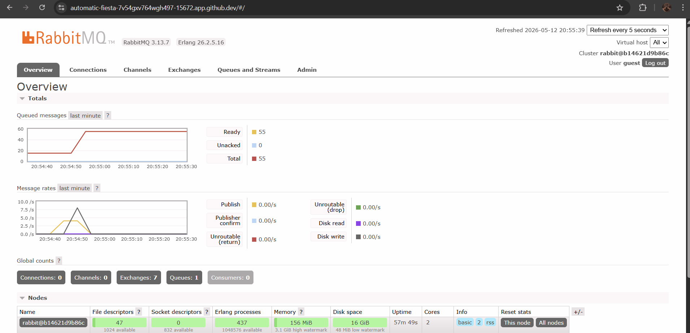
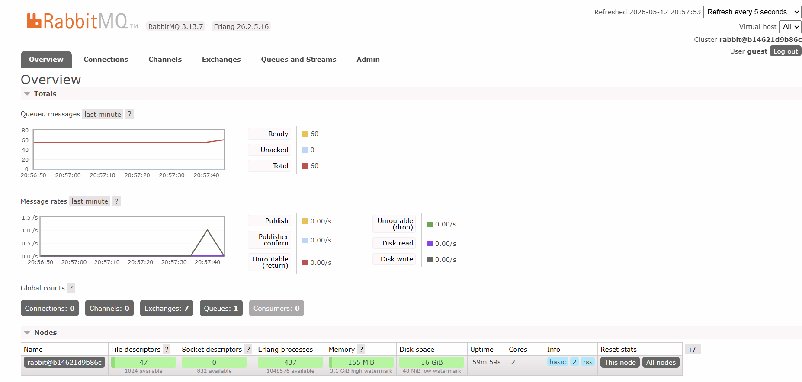

a. Apa itu AMQP?

AMQP atau Advanced Message Queuing Protocol adalah protokol standar terbuka untuk message-oriented middleware yang memungkinkan berbagai aplikasi dan sistem untuk saling berkomunikasi secara efisien. Dalam arsitektur event-driven, AMQP berfungsi sebagai bahasa komunikasi antara publisher sebagai pengirim pesan, message broker seperti RabbitMQ, dan subscriber sebagai penerima pesan. Protokol ini memastikan bahwa pesan dikirim, dirutekan, dan disimpan dengan aman dalam antrean sampai penerima siap memprosesnya, sehingga sistem tetap stabil meskipun ada lonjakan beban.

b. Apa arti dari guest:guest@localhost:5672?

String guest:guest@localhost:5672 merupakan Connection URI yang digunakan oleh program untuk melakukan autentikasi dan membangun koneksi dengan layanan message broker. Komponen pertama berupa kata guest sebelum tanda titik dua berfungsi sebagai username default yang telah diatur oleh sistem RabbitMQ . Komponen kedua yaitu kata guest setelah tanda titik dua merupakan password default untuk kredensial akses tersebut. Selanjutnya, bagian localhost mengacu pada alamat host yang menunjukkan bahwa layanan message broker berjalan secara lokal pada komputer yang sama dengan aplikasi. Terakhir, angka 5672 merujuk pada nomor port standar yang digunakan oleh protokol AMQP agar publisher maupun subscriber dapat mengirim dan menerima pesan melalui RabbitMQ.

### Simulation slow subscriber

Alasan mengapa jumlah antrean (total queue) di sistem saya bisa mencapai angka **21** adalah karena RabbitMQ sedang menjalankan perannya sebagai **buffer** (penyangga) dalam sistem asinkron. Angka tersebut muncul karena saya telah menjalankan perintah Publisher sebanyak beberapa kali secara berturut-turut dalam waktu singkat, sementara di sisi Subscriber telah diaktifkan simulasi jeda waktu (`sleep`) selama 1 detik untuk setiap pesan yang diproses. Karena kecepatan pengiriman pesan dari Publisher jauh melampaui kemampuan Subscriber untuk menyelesaikannya secara instan, pesan-pesan yang datang kemudian ditampung sementara oleh RabbitMQ di dalam antrean dengan status **"Ready"**. Munculnya angka 21 ini membuktikan bahwa arsitektur berbasis event ini sangat handal dalam menjaga ketersediaan data; sistem menjamin tidak ada pesan yang hilang meskipun terjadi ketidakseimbangan beban kerja (load) antara pihak pengirim dan penerima.

### Reflection and Running at least three subscribers

Penggunaan tiga subscriber sekaligus menunjukkan bagaimana pola Competing Consumers secara efektif meningkatkan skalabilitas sistem, di mana lonjakan (spike) pesan pada dashboard RabbitMQ berkurang jauh lebih cepat dibandingkan dengan hanya satu subscriber. Hal ini terjadi karena RabbitMQ mendistribusikan beban pesan dari antrean yang sama secara paralel ke semua unit pemrosesan yang tersedia menggunakan mekanisme Round Robin, sehingga total waktu eksekusi berkurang secara signifikan karena beban kerja dibagi rata.

Berdasarkan analisis kode, terdapat beberapa hal yang dapat ditingkatkan (improvement), seperti penerapan Quality of Service (QoS) atau prefetch count agar pembagian pesan lebih adil berdasarkan kesiapan subscriber, serta penambahan logika error handling yang lebih kuat untuk menggantikan unwrap() guna mencegah aplikasi berhenti total saat terjadi gangguan koneksi atau kegagalan pemrosesan pesan.

# BONUS

### “Simulation slow subscriber”

### “Reflection and Running at least three subscribers”

### Refleksi

Implementasi sistem pada infrastruktur GitHub Codespaces membuktikan bahwa pola Competing Consumers sangat efektif dalam menangani skalabilitas secara horizontal di lingkungan cloud. Dengan menjalankan beberapa subscriber secara paralel di dalam mesin virtual cloud, terlihat bahwa beban kerja dari antrean RabbitMQ dapat didistribusikan secara efisien melalui mekanisme round robin, yang secara signifikan mempercepat pembersihan lonjakan pesan (spike reduction) dibandingkan hanya menggunakan satu unit pemrosesan. Eksperimen ini juga menyoroti pentingnya manajemen jaringan dan keamanan pada arsitektur terdistribusi, di mana penggunaan kontainer Docker di cloud memerlukan pengaturan port forwarding dan autentikasi pengguna yang tepat agar komunikasi antar layanan tetap terjaga. Hasil pengamatan menunjukkan bahwa sistem asinkron ini mampu menjaga integritas data tanpa adanya duplikasi pemrosesan, sekaligus memberikan fleksibilitas untuk menambah kapasitas sistem secara instan tanpa perlu mengubah kode sumber utama, yang merupakan karakteristik krusial dalam membangun aplikasi berskala besar yang tangguh.